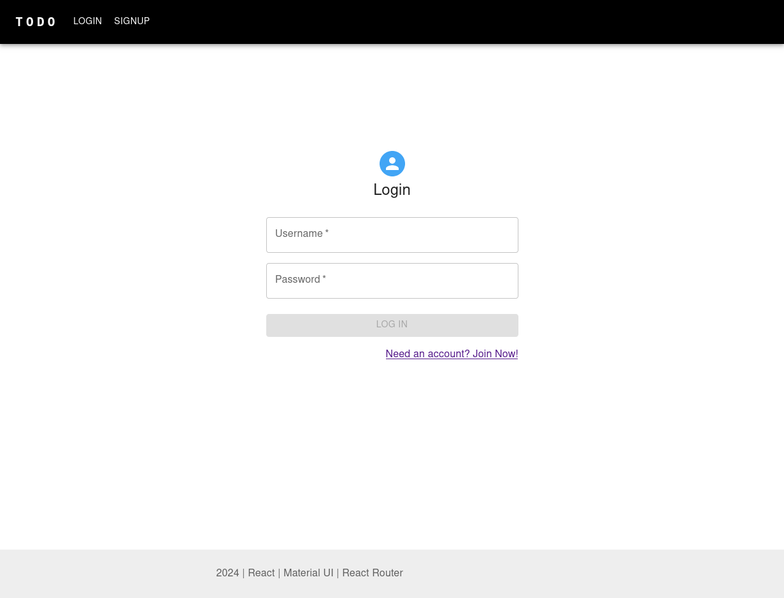

# Todo

Todo task manager web app.

Deployed web app can be found -> [HERE](https://todo-ogo1.onrender.com/) <-

[![Node][node shield]][node website]
[![TypeScript][typescript shield]][typescript website]
[![react][react shield]][react website]
[![Material UI][mui shield]][mui website]
[![SASS][sass shield]][sass website]
[![MongoDB][mongodb shield]][mongodb website]
[![Mongoose][mongoose shield]][mongoose website]
[![Apollo][apollo shield]][apollo website]
[![GraphQL][graphql shield]][graphql website]
[![bcrypt][bcryot shield]][bcrypt website]
[![Jwt][jwt shield]][jwt website]
[![React Router][react router shield]][react router website]
[![Express][express shield]][express website]
[![Vite][vite shield]][vite website]
[![ESLint][eslint shield]][typescript eslint website]
[![npm][npm shield]][npm website]
![Git][git shield]
[![GitHub][github shield]][github repo]

## Client frontend

The frontend contains 3 navigable pages, a non navigable editor page, and an
error page. It implements a [react][react website] based interface utilizing
[Apollo Client][apollo website] and [GraphQL][graphql website] for querying and
mutating the database and [Material UI][mui website] for styling. Below is a
breakdown of the frontend webpages:

- ### Login page

  <details>
    <summary>
      The Login page allows a user to authenticate and login.
    </summary>

    
  </details>

- ### Signup page

  <details>
    <summary>
      The Signup page allows a user to create an account.
    </summary>

    
  </details>

- ### Tasks page

  The Tasks page allows a user to view and create new todo tasks as well as
  select pre-existing todo tasks to edit or delete.

- ### Task page

  The Task page allows a user to edit or delete a task.

- ### Error page

  The error page is displayed when a user navigates to a page that does not
  exist. It contains link to the login/signup pages if a user is not logged in
  otherwise it displays a link to the tasks page or the option for a user to
  logout.

  <details>
    <summary>
      When not logged in.
    </summary>

    
  </details>

  <details>
    <summary>
      When logged in.
    </summary>

    
  </details>

## Server backend

The backend is an [express][express website] server that implements an
[Apollo Server][apollo website] and [GraphQL][graphql website] with
the [Mongoose][mongoose website] ODM for querying and mutating the database.

## Database structure

The database is a [MongoDB][mongodb website] NoSQL database that contains 2
collections. One collection of Users and one collection of Tasks.

### User model

The *User* model contains a string username and password and an array of *Task*s
which are references to Task documents from the *Task* collection. The user's
password is hashed before being stored to the database.

```gql
{
  _id: ObjectId
  username: String
  password: String
  tasks: [Task]
}
```

### Task model

The *Task* model contains a user field that references a *User* from the *User*
collection that owns the task, a title string, an accomplished boolean, and a
schedule date.

```gql
{
  _id: ObjectId,
  user: User
  title: String
  accomplished: Boolean
  schedule: Date
}
```

## Scripts

This package contains 4 scripts useful for development:

- `npm run dev`

  Runs both the react client front end and express apollo server backend locally.

- `npm run build`

  Builds the client front end and server backend distributable packages.

- `npm run react`

  Runs only the react client frontend locally.

- `npm run express`

  Runs only the express graphql apollo server backend locally.

- `npm run seed`

  Seeds the database with users that each have a random number of tasks.

- `npm run drop`

  Drops the database.

- `npm start`

  Builds the distributable react frontend and express apollo server backend
  packages and starts the express server.

[node shield]: https://img.shields.io/badge/node.js-6DA55F?style=for-the-badge&logo=node.js&logoColor=white "node"
[node website]: https://nodejs.org/en/about "node"
[typescript shield]: https://img.shields.io/badge/typescript-%23007ACC.svg?style=for-the-badge&logo=typescript&logoColor=white "TypeScript"
[typescript website]: https://www.typescriptlang.org/ "TypeScript"
[sass shield]: https://img.shields.io/badge/SASS-hotpink.svg?style=for-the-badge&logo=SASS&logoColor=white "SASS"
[sass website]: https://sass-lang.com/ "SASS"
[react shield]: https://img.shields.io/badge/react-%2320232a.svg?style=for-the-badge&logo=react&logoColor=%2361DAFB "React"
[react website]: https://react.dev/ "React"
[mongodb shield]: https://img.shields.io/badge/MongoDB-%234ea94b.svg?style=for-the-badge&logo=mongodb&logoColor=white "MongoDB"
[mongodb website]: https://www.mongodb.com/ "MongoDB"
[mongoose shield]: https://img.shields.io/badge/Mongoose-880000?style=for-the-badge&logo=MongoDB&logoColor=white "Mongoose"
[mongoose website]: https://mongoosejs.com/ "Mongoose"
[mui shield]: https://img.shields.io/badge/MUI-%230081CB.svg?style=for-the-badge&logo=mui&logoColor=white "Material UI"
[mui website]: https://mui.com/ "Material UI"
[apollo website]: https://www.apollographql.com/ "Apollo"
[apollo shield]: https://img.shields.io/badge/-ApolloGraphQL-311C87?style=for-the-badge&logo=apollo-graphql "Apollo"
[graphql shield]: https://img.shields.io/badge/-GraphQL-E10098?style=for-the-badge&logo=graphql&logoColor=white "GraphQL"
[graphql website]: https://graphql.org/ "GraphQL"
[jwt shield]: https://img.shields.io/badge/JWT-black?style=for-the-badge&logo=JSON%20web%20tokens "JSON Web Token"
[jwt website]: https://jwt.io/ "JSON Web Token"
[react router shield]: https://img.shields.io/badge/React_Router-CA4245?style=for-the-badge&logo=react-router&logoColor=white "React Router"
[react router website]: https://www.npmjs.com/package/react-router "React Router"
[bcryot shield]: https://img.shields.io/badge/bcrypt-%23FFFFFF.svg?style=for-the-badge&logo=bcrypt&logoColor=white "bcrypt"
[bcrypt website]: https://www.npmjs.com/package/bcrypt "bcrypt"
[express shield]: https://img.shields.io/badge/express.js-%23404d59.svg?style=for-the-badge&logo=express&logoColor=%2361DAFB "Express"
[express website]: https://expressjs.com/ "Express"
[vite shield]: https://img.shields.io/badge/vite-%23646CFF.svg?style=for-the-badge&logo=vite&logoColor=white "Vite"
[vite website]: https://vitejs.dev "Vite"
[eslint shield]: https://img.shields.io/badge/ESLint-4B3263?style=for-the-badge&logo=eslint&logoColor=white "TypeScript ESLint"
[typescript eslint website]: https://typescript-eslint.io/ "TypeScript ESLint"
[npm shield]: https://img.shields.io/badge/NPM-%23CB3837.svg?style=for-the-badge&logo=npm&logoColor=white "npm"
[npm website]: https://www.npmjs.com/ "npm"
[git shield]: https://img.shields.io/badge/git-%23F05033.svg?style=for-the-badge&logo=git&logoColor=white "Git"
[github shield]: https://img.shields.io/badge/github-%23121011.svg?style=for-the-badge&logo=github&logoColor=white "GitHub repo"
[github repo]: https://github.com/SnapperGee/portfolio "GitHub repo"
